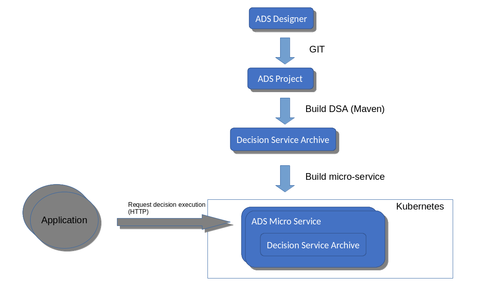
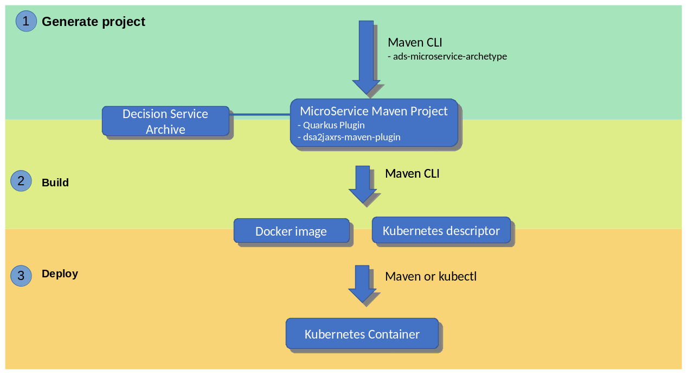
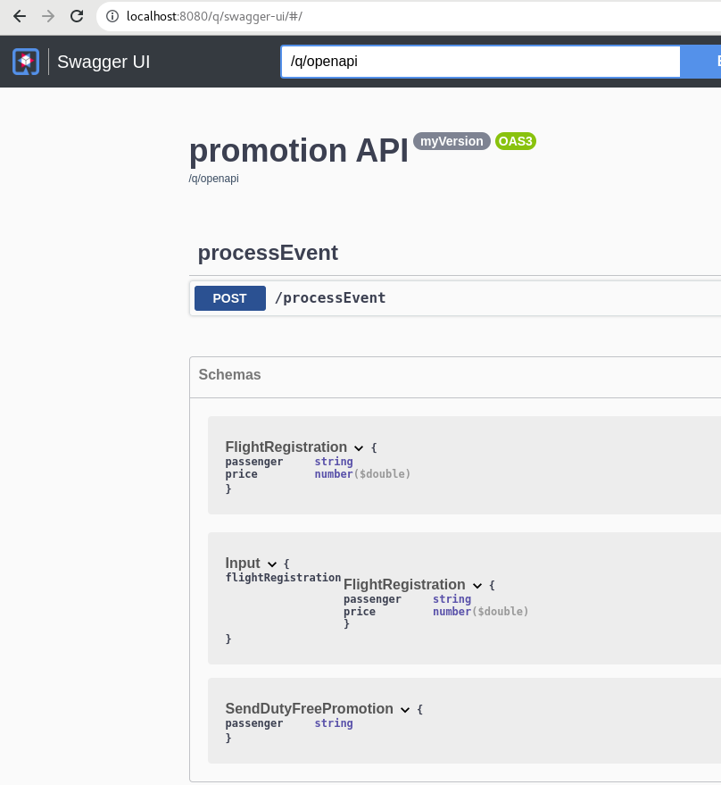

# Executing decisions as microservices with Automation Decision Services in Kubernetes

[](https://github.com/DecisionsDev/ads-micro-decision-service)
[](https://opensource.org/licenses/Apache-2.0)

## Introduction

[Automation Decision Services](https://www.ibm.com/docs/en/cloud-paks/cp-biz-automation/22.0.1?topic=automations-what-is-automation-decision-services)
 (ADS) is part of the
[IBM Cloud Pak for Business Automation](https://www.ibm.com/docs/en/cloud-paks/cp-biz-automation)
and  provides capabilities for authoring and running decisions.

With Automation Decision Services, you can run decisions with:
- [Decision runtime](https://www.ibm.com/docs/en/cloud-paks/cp-biz-automation/22.0.1?topic=automations-executing-decision-services), a server that offers an HTTP
API and capabilities to manage and execute a large number of decisions persisted
in an external storage.
- [Execution Java API](https://www.ibm.com/docs/en/cloud-paks/cp-biz-automation/22.0.1?topic=services-executing-decision-execution-java-api).

The goal of this project is to show how to deploy a decision service modeled in Automation Decision Services as a lightweight microservice in a Kubernetes realm with a web interface specific
to the decision.
The project describes how to build and deploy a microservice based on a decision service archive (DSA) to execute your digital decisions as part
of a DevOps pipeline.



This microservice blueprint offers a native Kubernetes & Docker approach with a complete isolation. Multiple decision microservices run as separated containers that scale independently.
In term of performance, the lightweight stack minimizes the boot time for the
first execution compared to the decision runtime,
and fits well with the horizontal scalability provided by HTTP(S) load balancers.

## DevOps pipeline overview



To get the decision microservice running, you proceed through a DevOps pipeline with the following steps:

- [*Step 0 - Prepare for the Automation Decision Services project setup*](#step-0---preparing-for-the-automation-decision-services-project-setup)
- *[Step 1 - Generate a microservice Maven project](#step-1---generating-a-microservice-maven-project)*

  A specific maven project for building the microservice
  is generated by a Maven command line.
  It requires Maven coordinates for a decision service archive (DSA)
  that is deployed in a Maven repository.
- *[Step 2 - Build microservice artifacts](#step-2---building-micro-service-artifacts)*

  The Maven project of the microservice generates a Docker image that contains the microservice and the Kubernetes descriptor.
- *[Step 3 - Deploy in Kubernetes](#step-3---deploying-in-kubernetes)*
- *[Step 4 - Test your microservice](#step-4---testing-the-microservice)*

## Building a decision microservice

### Step 0 - Preparing for the Automation Decision Services project setup

#### Check the prerequisites

- OpenJDK 11 (tested with `OpenJDK 1.0.13`)
- IBM Java SDK 1.1.8
- Maven 3 (tested with `Maven 3.8.4`)
- Docker (tested with Docker 20.10.16)
- kubectl command line configured to access a Kubernetes cluster configured
  to use a registry of docker images
- Automation Decision Services installation (tested with Automation Decision Services 22.0.1)

#### Clone the repository

Clone this project repository from GitHub in your machine:

```sh
git clone https://github.com/DecisionsDev/ads-microservice.git
```

#### Install Automation Decision Services library JARs

To build the microservice, you need to install 
the JARs required by the execution Java API in your Maven repository.
 
The JARs for the Automation Decision Services Maven plug-in are required to compile the sample decision service in this repository.

For more information, see the documentation for
[Deploying the Automation Decision Services JAR files to a Maven repository](
https://www.ibm.com/docs/en/cloud-paks/cp-biz-automation/22.0.1?topic=automations-setting-up-your-build-environment).

#### Get a decision service archive

You need a decision service archive to create a decision microservice.

You can build one from this repository:

```sh
cd samples/Promotion
mvn clean install
```

It installs the decision service archive in the local Maven repository with the following artifact
coordinates:

- `groupId`: `ads.projects.promotionDecisionService`
- `artifactId`: `promotionDecisionService`
- `version`: `1.0.0-SNAPSHOT`

> The Java SDK 8 must be used for building the decision service archive. The next steps requires the Java SDK 11.

#### Build the Maven plug-ins 

Compile the Maven plug-ins of this project and install them in the local
Maven repository:

```sh
cd dsa2jaxrs-maven-plugin
mvn clean install
```

```sh
cd ads-microservice-archetype
mvn clean install
```

> The Maven plug-ins can be used for building any decision microservice. Therefore, you
  compile and install them once for all your microservice builds.

### Step 1 - Generating a microservice Maven project

#### What

A specific Maven project for building the microservice
is generated by a Maven command line.

It requires the Maven coordinates for a decision service archive (DSA)
deployed in a Maven repository.

The Maven command line uses a
[Maven archetype](https://maven.apache.org/guides/mini/guide-creating-archetypes.html),
which is provided in this GIT repository: [ads-microservice-archetype](ads-microservice-archetype).

#### How

To generate the Maven project of the microservice:

In any empty directory, use the `ads-microservice-archetype` to generate the
microservice Maven project:

```sh
mvn archetype:generate                              \
  -DarchetypeGroupId=com.ibm.decision.microservice  \
  -DarchetypeArtifactId=archetype                   \
  -DarchetypeVersion=1.0.0-SNAPSHOT                 \
  -DgroupId=ads.microservice                        \
  -DartifactId=promotion                            \
  -Dversion=myVersion                               \
  -DdsaGroupId=ads.projects.promotion               \
  -DdsaArtifactId=promotionDecisionService          \
  -DdsaVersion=1.0.0-SNAPSHOT                       \
  -B
```

where:

- `dsaGroupId` is the `groupId` of the decision service archive in the Maven repository
- `dsaArtifactId` is the `artifactId` of the decision service archive in the Maven repository
- `dsaVersion` is the `version` of the decision service archive in the Maven repository
- `groupId`/`artifactId`/`version` are the maven coordinate of the
  generated Maven project

Depending on your usage, modify the annotations in the
`mymicroservice/src/main/resources/application.properties` file for correctly tracking the Automation Decision Services usage.
For more information, see the documentation [Tracking usage](
https://ibmdocs-test.mybluemix.net/docs/en/cloud-paks/cp-biz-automation/22.0.1?topic=api-tracking-usage).

### Step 2 - Building micro-service artifacts

#### What

The Maven project of the microservice generates a Docker image that contains
the microservice and the Kubernetes descriptor.

The Maven project uses:

- a Maven plug-in [dsa2jaxrs-maven-plugin](dsa2jaxrs-maven-plugin), which is provided in this
  GIT repository, to
  generate the source code of the microservice from the decision service archive available in the
  dependencies of the Maven project. The generated web API
  is specific to the decision service and exposes the input and output
  parameter types. The implementation uses the execution Java API.
- Quarkus to create the Docker image and generate the Kubernetes descriptor

The Maven project produces:

- a Docker image that contains a lightweight web service
  embedding the decision service archive and using the execution Java API. The service is autonomous and it
  does not require any external services.
- a Kubernetes descriptor for creating the container in a Kubernetes cluster

#### How

To build the microservice with the previously created Maven project:

```sh
cd promotion
mvn clean package -Dquarkus.container-image.build=true
```

It generates:

- the Docker image in your local docker registry
- the Kubernetes descriptor in the directory target/kubernetes

### Step 3 - Deploying in Kubernetes

#### What

The creation of the containers in the Kubernetes cluster can be done by the usual ways from
the Docker image and Kubernetes descriptor.
Alternatively, the Quarkus Maven plug-in can also be used for creating 
the Kubernetes containers.

#### How

To create the microservice containers in your Kubernetes cluster, you can manually deploy
the Docker image that is previously generated, adapt the generated Kubernetes
descriptor, and deploy them.

Alternatively, you can also use Maven to build the docker image, and deploy it
to the Docker image registry of your Kubernetes cluster and create the containers:

```sh
mvn clean package \
 -Dquarkus.container-image.build=true \
 -Dquarkus.container-image.registry=my.docker-registry.net \
 -Dquarkus.container-image.push=true \
 -Dquarkus.kubernetes.deploy=true
```

where `my.docker-registry.net` is the URL of the Docker image registry of your
Kubernetes cluster.

### Step 4 - Testing the microservice

For testing your deployed microservice, you bind the service port
to a port of your machine:

```sh
kubectl port-forward  service/mymicroservice 8080:80
```

In your browser, open the [swagger-ui](http://localhost:8080/q/swagger-ui/#/)
to test the execution of the decision.



You get the OpenAPI schema of the web API at
<http://localhost:8080/q/openapi.json>. The schema is specific to
the decision, exposing the precise type of input and output of the decision.
The schema can be used in various tools, for example, to generate a client of
the web API.

## License

[Apache 2.0](LICENSE)

## Notice

© Copyright IBM Corporation 2022.

[](https://github.com/DecisionsDev/ads-microservice)
[](https://opensource.org/licenses/Apache-2.0)
